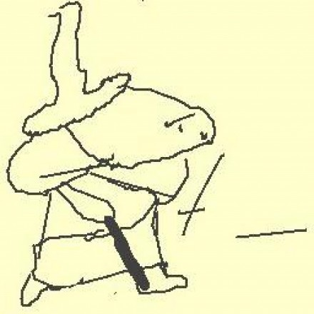

title: lessone
speaker: youxiachai
url: https://github.com/leannodejs/leannodejs.github.io
transition: cards

[slide]

# Node.js第一课

[slide]

## 演讲者信息

* github: https://github.com/youxiachai
* weibo: @游戏阿柴
* blog: http://blog.gfdsa.net

[slide]

# 大纲 {:&.flexbox.vleft}

* Node.js 项目构建与依赖管理  {:&.build}
* 用Express编写第一个Node.js程序
* 使用Mocha进行单元测试

[slide]

# Node.js 项目构建与依赖管理

[slide]

## CommandJS 规范

[slide]

## 神奇的NPM

[slide]

## 扩展阅读

[Node.js 项目的依赖管理](http://deadhorse.me/nodejs/2014/01/18/node_dependences_version.html)

[slide]

# 用Express编写第一个Node.js程序

[slide]

## Express 启动过程

[slide]

## Express 路由规则

[slide]

## 编写第一个中间件

[slide]

# 使用Mocha进行单元测试

[slide]

## 用上单测不侧漏

[slide]
